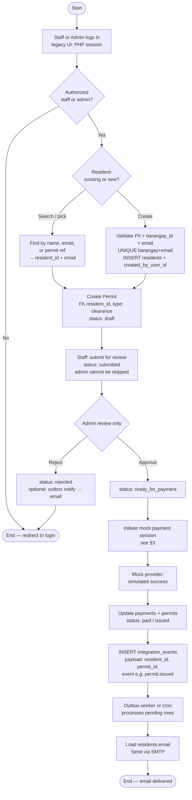
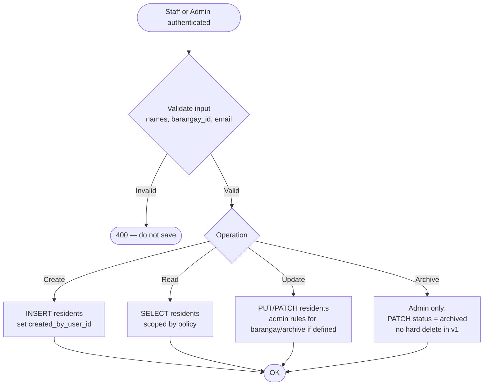
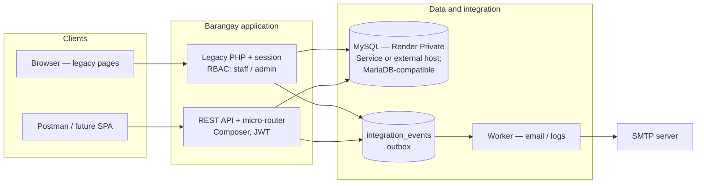
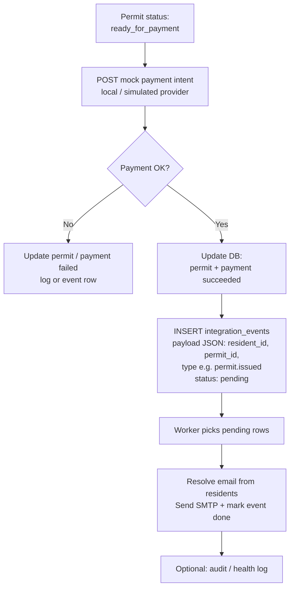
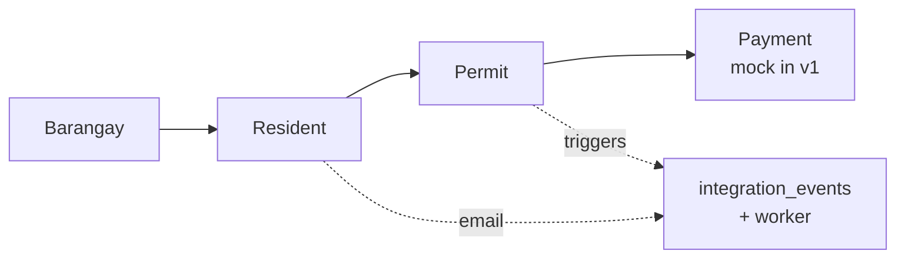
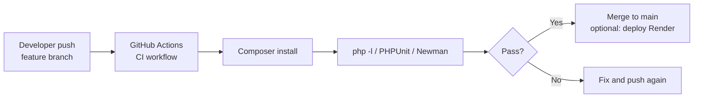

# Flowcharts — Barangay e-Governance (v1)

**Related docs:** `STAFF_ADMIN_ROADMAP.md` (phases), `RESIDENT_ROADMAP.md` (resident data + API).

View diagrams in **GitHub**, **VS Code** (Markdown Preview + Mermaid), or paste into [Mermaid Live Editor](https://mermaid.live) to **export PNG/SVG** for your PDF.

---

## 1. Permit & clearance workflow (v1 — staff-entered)

Primary happy path: **Barangay Clearance**, **mock payment**, **email to `residents.email`** (no SMS in v1). **Resident** is **data only**—no resident login in v1.

---

## 2. Resident master data (staff / admin only — v1)

No **resident** role on `users` until a future portal phase — see **`RESIDENT_ROADMAP.md` §8**. Data, rules, and workflow: **§§1–3** in that file.

---

## 3. Who uses which door (session vs JWT)

---

## 4. Mock payment + outbox (integration)

Worker resolves **`resident_id`** from payload (or JOIN via `permit_id`) to find **email**.

---

## 5. Entity trail (context — not a full ERD)

Use **F. Database Design** / ERD in PDF for keys and full schema. This is a **logical** chain for narratives.

---

## 6. DevOps — push to GitHub (light automation)

---

## Document map (PDF)

| Diagram | Suggested PDF section |
|---------|------------------------|
| §1 Permit + resident link | Integration Design, System Architecture |
| §2 Resident CRUD (staff) | Database / Security — RBAC, `RESIDENT_ROADMAP.md` narrative |
| §3 Session vs JWT | Security — Authentication & Authorization |
| §4 Mock pay + outbox | Middleware / Event-based Integration |
| §5 Entity trail | Introduction or Database Design preamble |
| §6 CI | DevOps Pipeline |

---

*Aligned with `STAFF_ADMIN_ROADMAP.md` and `RESIDENT_ROADMAP.md` (staff/admin v1, mock payments, real email, DB outbox, no resident login in v1).*
